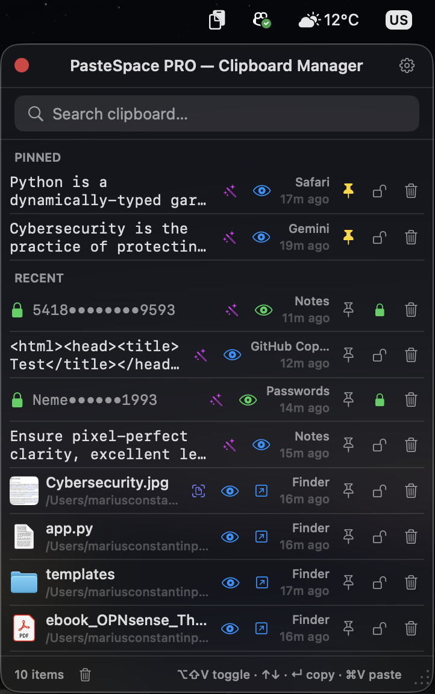
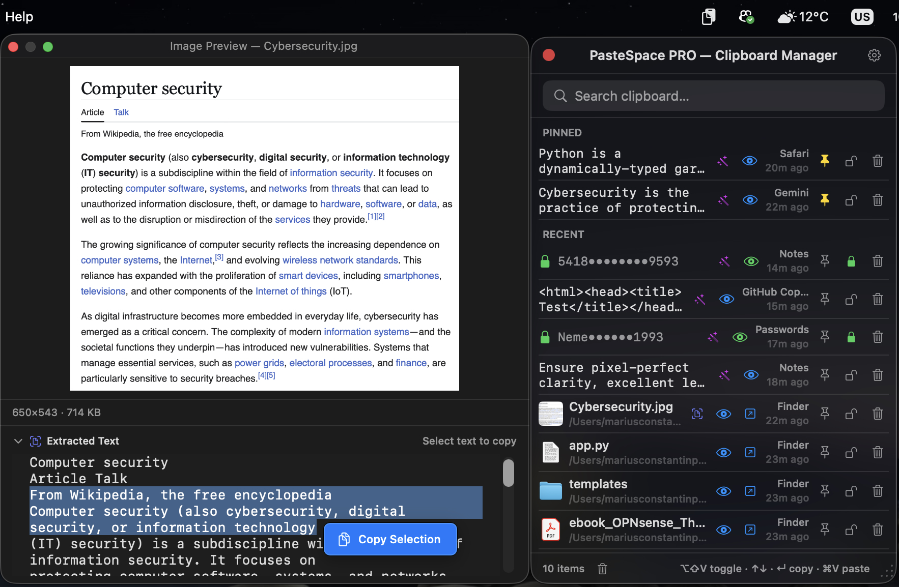
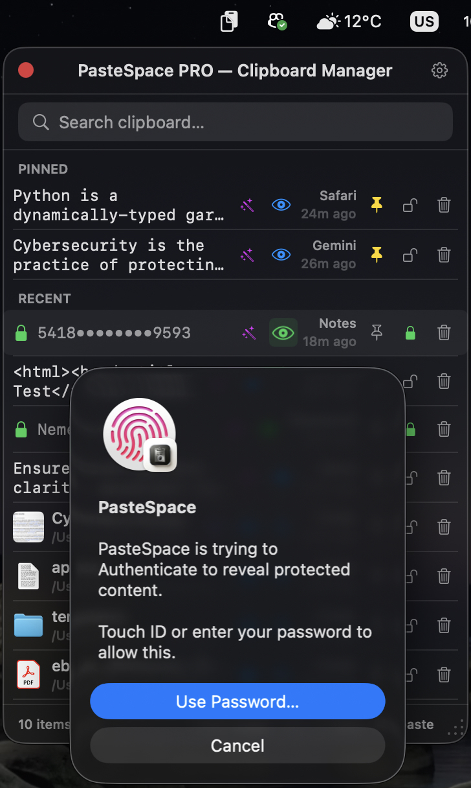
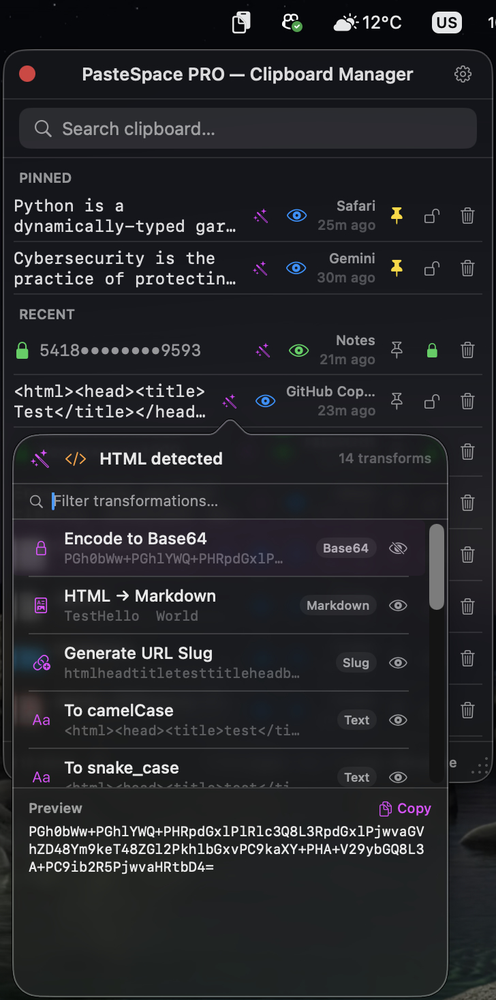
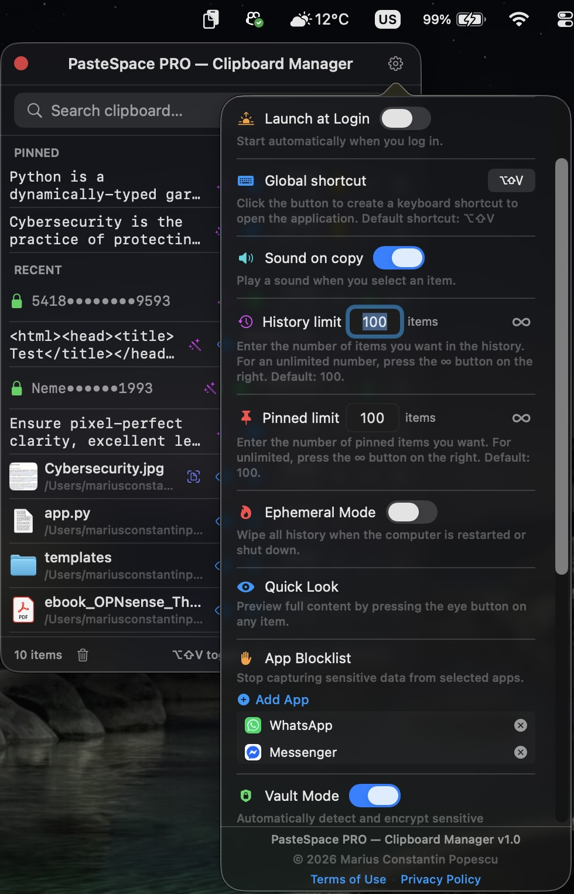
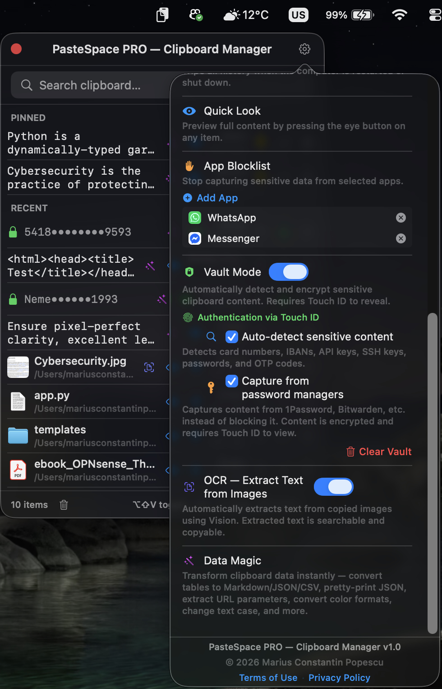

<h1 align="center">PasteSpace — Clipboard Manager</h1>

<p align="center">
  <strong>Secure clipboard history for macOS. Native. Private. Yours.</strong> · <a href="https://apps.apple.com/ro/app/pastespace-clipboard-manager/id6762815491?mt=12" rel="noopener noreferrer">Open in the Mac App Store</a>
</p>

<p align="center">
  
  
  
  
  
  
  
</p>

<p align="center">
  Free to use · Pro is <strong>$19.99 once, forever</strong> · No subscriptions
</p>

---

## The Problem

You copy a phone number, then a link, then a paragraph from a document. When you need that phone number again, it's gone—replaced by the last item you copied.

You dig through your browser history, reopen documents, or scroll through messages to find it again, wasting valuable time.

**PasteSpace remembers your clipboard history** so you don't have to.

---

## How It Works

PasteSpace lives in your **menu bar** as a small clipboard icon (📋). Every time you press `⌘C`, PasteSpace captures your copied content and adds it to a searchable history.

**Here's what using PasteSpace looks like:**

1. You're writing an email and need a client's address you copied an hour ago.
2. Press **⌥⇧V** (or your custom shortcut) — PasteSpace opens instantly.
3. Type "Bucharest" in the search bar — the address appears immediately.
4. Press **Enter** — it's copied and ready to paste.

No switching apps. No reopening documents.

---

## What's New in PasteSpace 2.0

PasteSpace 2.0 is a major update focused on richer clipboard fidelity, a more consistent visual design, and smoother workflows across current and upcoming macOS versions.

- **macOS 27 beta compatibility** — menu bar behaviour, status-item sizing, popovers, and Quick Look flows were adjusted for the new macOS 27 menu bar and windowing changes while keeping compatibility with macOS 14, 15, and later.
- **Redesigned history UI** — the history list now uses a unified visual language with standardized monochrome SF Symbols, consistent typography, improved spacing, clearer action buttons, and better content hierarchy for text, links, files, folders, archives, apps, disk images, media, and file groups.
- **Rich-text clipboard fidelity** — formatted text is now captured and pasted with its original formatting instead of being reduced to plain text.
- **Quick Look text editor** — Quick Look is no longer just a viewer; text items can now be edited, formatted, highlighted, saved, and copied directly from the floating panel.
- **Plain-text controls** — new settings let you always capture formatted text as plain text or always paste text as plain text. Dedicated plain-text paste buttons are also available in history and Quick Look for one-off clean pastes.
- **QR Code Generator** — generate offline QR codes for copied text, links, contact details, Wi-Fi credentials, and other snippets.
- **Drag & Drop Copy** — drag text, links, images, files, and groups of files directly from history into other apps. Vault-protected items authenticate before data is delivered.
- **Safer history management** — non-Vault deletion now asks for confirmation, while Vault deletion remains protected by Touch ID or device password.
- **Stronger Ephemeral Mode** — ephemeral cleanup now takes effect when PasteSpace quits, including before restart or shutdown.

---

## Screenshots

<p align="center"><em>Click each section to expand the screenshot.</em></p>

<details open>
  <summary><strong>📋 Clipboard history</strong> — your entire clipboard, one keystroke away</summary>
  <br/>
  <p align="center">
    
  </p>
</details>

<details>
  <summary><strong>🔍 OCR</strong> — search inside images</summary>
  <br/>
  <p align="center">
    
    <br/>
    <em>Copy a screenshot — PasteSpace extracts the text automatically so you can search inside images.</em>
  </p>
</details>

<details>
  <summary><strong>🔐 Vault Mode</strong> — hardware-backed encryption with Touch ID</summary>
  <br/>
  <p align="center">
    
    <br/>
    <em>Vault Mode auto-encrypts sensitive data with AES-256-GCM. Reveal with Touch ID.</em>
  </p>
</details>

<details>
  <summary><strong>🪄 Data Magic</strong> — 30+ instant transformations</summary>
  <br/>
  <p align="center">
    
    <br/>
    <em>Data Magic — 30+ one-tap transformations for JSON, colors, dates, Base64, and more.</em>
  </p>
</details>

<details>
  <summary><strong>✏️ Quick Look Text Editor</strong> — full rich-text editing from your clipboard</summary>
  <br/>
  <p align="center">
    
    <br/>
    <em>Edit, format, and save clipboard text directly inside PasteSpace — no external app needed.</em>
  </p>
</details>

<details>
  <summary><strong>📷 QR Code Generator</strong> — turn any copied text into a scannable QR code</summary>
  <br/>
  <p align="center">
    
    <br/>
    <em>Instant QR code for any URL, contact, Wi-Fi credential, or text — generated locally, offline.</em>
  </p>
</details>

<details>
  <summary><strong>⚙️ Settings</strong> — general preferences</summary>
  <br/>
  <p align="center">
    
    <br/>
    <em>Fine-tune PasteSpace to your workflow — shortcuts, history limits, and privacy options.</em>
  </p>
</details>

<details>
  <summary><strong>⚙️ Settings</strong> — advanced controls</summary>
  <br/>
  <p align="center">
    
    <br/>
    <em>Advanced controls: App Blocklist, Ephemeral Mode, and Pro upgrade.</em>
  </p>
</details>

---


## Features

### ✨ Unified macOS Design

PasteSpace 2.0 introduces a refreshed interface built around clarity and consistency. The history list uses a unified icon system, consistent typography, and rearranged controls so each item is easier to scan, understand, and act on.

- **Standardized visual language** — item thumbnails use monochrome SF Symbols for text, rich text, links, folders, PDFs, archives, apps, disk images, audio, video, images, and file groups.
- **Improved readability** — text, metadata, badges, and action buttons are arranged to make the copied content easier to identify at a glance.
- **Consistent controls** — Quick Look, Data Magic, QR Code, Vault, pin, delete, open, and plain-text actions use a cleaner shared style across the entire history.
- **System-aware appearance** — icons and controls adapt correctly to Light and Dark mode.

---

### 📋 Clipboard History

Every piece of text, every image, and every file you copy is kept in a searchable, scrollable list.

**Real-world example:**
> You're filling out a form that asks for your name, email, phone, address, and IBAN — all stored in different places. Instead of switching between apps multiple times, you can copy all the information beforehand. It will all be in your PasteSpace history, ready to be pasted.

- **Instant search** — type a word to find it across your entire history.
- **Pin items** — keep your most-used snippets, templates, or credentials at the top.
- **Source tracking** — every item shows the application it was copied from (Safari, Xcode, Notes, etc.).
- **Global shortcut** (`⌥⇧V`) — open PasteSpace from any app without touching the mouse.
- **Rich-text fidelity** — formatted text is captured exactly as it appeared in the source app — fonts, sizes, colours, bold, italic, highlights, and styling are preserved. Earlier versions stored every text item as plain text; PasteSpace now keeps both plain and formatted text correctly.
- **Plain-text controls** — choose whether formatted text should be captured as plain text, pasted as plain text, or pasted normally with formatting. You can set this globally in Settings or use dedicated one-off plain-text paste buttons.
- **Multi-file groups** — when you copy several files at once, PasteSpace keeps them together as one history item, shows the group clearly, and can copy or drag them back as a group.

---

### 🔐 Vault Mode — Hardware-Backed Encryption

Unlike apps that merely hide data from plain sight, PasteSpace **encrypts** it. It uses **AES-256-GCM** via Apple's CryptoKit framework. Your encryption key is stored in the macOS **Keychain**, hardware-backed by the **Secure Enclave** on Apple Silicon.

**Real-world example:**
> You copy your credit card number for an online checkout. PasteSpace **detects** the sensitive data and **encrypts it on the spot**. Your clipboard history will show a masked version like `5418 •••• •••• 9593`. To reveal or use it, you need to authenticate with your **fingerprint or device password**.

**Auto-detected and encrypted data:**
- Credit/debit card numbers
- IBANs and bank account numbers
- API keys and tokens (GitHub, Slack, Stripe, JWT)
- SSH keys and fingerprints
- Software license keys
- Passwords from password managers
- OTP codes from authenticator apps
- High-entropy strings that resemble secrets

**How Vault works in practice:**

| You copy... | What happens | What you see in history |
|---|---|---|
| `4532 7891 2345 6789` | Auto-detected as credit card → encrypted | `4532 •••• •••• 6789` 🔒 |
| `ghp_abc123def456ghi789` | Auto-detected as GitHub token → encrypted | `ghp_a••••••••••i789` 🔒 |
| `Hello world` | Normal text → stored normally | `Hello world` |
| Any text you choose | Manual vault (click 🔒) → encrypted | `Hello••••orld` 🔒 |

**To reveal a Vault item:** tap the 👁 button → authenticate with Touch ID → the content is revealed and automatically hides when you're done.

Vault items survive **Clear All** and **Ephemeral Mode** — they remain until you explicitly remove them.

---

### 🔍 OCR — Text Extraction from Images

When you copy an image, a screenshot, or a photo, PasteSpace **automatically extracts the text in the background** using Apple's Vision framework.

**Real-world example:**
> You copy a screenshot of an error log. Later, you need to look up an error code from that screenshot. You type the code in the PasteSpace search bar, and the screenshot appears in your results because the text was already extracted.

- **Automatic** — copy an image and the text is extracted immediately.
- **Searchable** — find images by typing words that appear inside them.
- **Copyable** — open Quick Look on an OCR image to select and copy specific portions of the text.
- **Local** — all processing happens on your Mac's CPU/GPU. No data is uploaded.

---

### 🪄 Data Magic — Instant Transformations

PasteSpace detects the format of the data you copied and offers **one-tap transformations** directly in your clipboard history, eliminating the need for external converter tools.

**Real-world examples:**

> **Developer:** Copy a minified JSON response. Click 🪄 → "Pretty-print JSON" → the perfectly formatted JSON is ready to paste.
> **Designer:** Copy a color value `#FF5733`. Click 🪄 → "HEX to RGB" → `rgb(255, 87, 51)` is copied.
> **Writer:** Copy uppercase text. Click 🪄 → "To Title Case" → text is properly capitalized.
> **Data Analyst:** Copy a table from a spreadsheet. Click 🪄 → "Table to Markdown" → the markdown table is ready for documentation.

**Available transformations include:**

| You copied | Available transformations |
|---|---|
| **JSON** | Pretty-print, Minify, → YAML, → XML |
| **URL with parameters** | Extract parameters, URL encode/decode |
| **Color** (`#FF5733`) | HEX ↔ RGB ↔ HSL ↔ SwiftUI Color |
| **Date** (`2026-04-11`) | → Unix timestamp, → ISO 8601, → readable |
| **Unix timestamp** | → Human-readable date |
| **Table** (tab/CSV) | → Markdown table, → JSON, → CSV |
| **HTML** | → Markdown, → plain text |
| **Markdown** | → HTML |
| **Base64** | Decode ↔ Encode |
| **Any text** | UPPER, lower, Title Case, camelCase, snake_case, kebab-case, URL slug, word count, JSON/HTML escape |
| **YAML** | → JSON |
| **XML** | → JSON |

**Over 30 transformations — all offline and instant.**

---

### 👁 Quick Look — Full Rich-Text Editor

Quick Look has evolved from a simple viewer into a **complete rich-text editing environment**. Open a text item in a floating panel, edit it, format it, save it back to history, or copy the edited version immediately.

**Real-world example:**
> You copied a paragraph from a report that needs light editing before you paste it into a presentation. Instead of pasting it into a document, making changes, re-copying, and then pasting again, you open Quick Look, edit directly, and paste the final version in one step.

**What you can do in Quick Look:**

- **Read mode** — view the full content of any text, image, file, or Vault item in a floating panel.
- **Edit mode** — click **Edit** to enter a full rich-text editor:
  - Change **font family**, **size**, **bold**, **italic**, **underline**, **strikethrough**
  - Apply **text colour** from a 27-colour palette
  - Apply **highlight colour** with the same palette
  - Clear formatting from selected characters
  - Adjust **paragraph alignment** (left, center, right, justified)
  - Add **bullet lists** and **numbered lists**
- **Smart plain-text preservation** — if the original item was plain text, characters you *didn't* touch are pasted to the destination using that app's own font and colour (white on a dark Pages page, body font in Word), while only the characters you actually formatted carry your explicit styling.
- **Save** — changes are saved back to your clipboard history so the edited version is available for future pastes.
- **Copy Edited** — copies the edited content to the clipboard instantly.
- **Paste as plain text from Quick Look** — use the dedicated plain-text action when you want the edited or previewed text to match the destination app instead of preserving formatting.
- For **images**, Quick Look shows the full image alongside the OCR-extracted text.
- For **Vault items**, Quick Look opens only after Touch ID authentication and auto-masks the item when the panel is closed.

---

### 📷 QR Code Generator

Turn any copied text into a **scannable QR code** in one tap — without opening a browser, visiting a website, or installing a separate tool.

**Real-world examples:**
> **Sharing a Wi-Fi password:** Copy the password → click 📷 → show the QR code to a guest. Their phone scans it and connects instantly.
> **Sharing a link:** Copy a URL → click 📷 → a QR code is generated. Scan it with your phone to open on mobile.
> **Sharing contact info:** Copy your phone number or email → click 📷 → the other person scans it instead of typing it out.

- **Completely offline** — generated on-device using Apple's CoreImage framework. No data is sent anywhere.
- Works for any copied text: **links, URLs, emails, phone numbers, Wi-Fi credentials, plain text, addresses**, and other snippets.
- Displayed in a floating panel that stays on screen while you work.

---

### 🖱️ Drag & Drop Copy

You don't need to click the copy button. You can **drag items directly from your PasteSpace history** into apps that accept drops.

**Real-world examples:**
> **Dragging files:** Drag one file — or a group of files copied together — from PasteSpace into Finder, Mail, Slack, or another file destination.
> **Dragging text:** Drag a text snippet from history into any text field — it's inserted at the drop point.
> **Dragging an image or link:** Drag an image into a document, or a link into a browser, note, or message.

- Works for **text, images, URLs, single files, and multi-file groups**.
- File groups are kept together in history and dragged back as real files, not shortcuts.
- **Vault items** require Touch ID authentication before the content is handed to the destination app — the decrypted data is delivered only after you authenticate.

---

### ⚙️ Plain Text Controls

PasteSpace gives you full control over when formatting is kept and when it is stripped.

**Available options:**

- **Always copy as plain text** — formatted text will only be captured as plain text. This is useful if you want your history to stay clean and style-free.
- **Always paste as plain text** — formatting will be ignored and the text will be pasted as plain text. The stored history item is not modified.
- **One-off plain-text paste buttons** — dedicated buttons in the history row and in Quick Look let you paste a specific text item as plain text without changing your global settings.

**When this is useful:**
> You're writing in a note-taking app and want every paste to match your document's existing font and size — no bold headings, colour overrides, or size jumps from a webpage or document you copied from.

These controls work for **plain text, rich text, links, and formatted clipboard content**, and can be toggled at any time without restarting the app.

---

### 🛡️ App Blocklist

Prevent PasteSpace from storing sensitive data from specific applications. If you add your banking app or a medical software to the blocklist, anything copied from it is completely ignored by PasteSpace.

---

### 🗑️ Safer Deletion

PasteSpace now asks for confirmation before deleting standard history items. Vault item deletion remains protected by Touch ID or device password, so sensitive entries cannot be removed accidentally without authentication.

---

### ⏳ Ephemeral Mode

When activated, your standard clipboard history is **automatically wiped when PasteSpace quits**, including when the app is closed before a macOS restart or shutdown. Vault items are always preserved, and pinned items can also be preserved depending on your setting, ensuring a clean slate while keeping important data secure.

---

## Free vs. Pro

PasteSpace is **free to use** with generous limits. Pro removes the capacity limits for a single payment.

| Feature | Free | Pro ($19.99 — lifetime) |
|---|---|---|
| Clipboard history | 10 items (rolling) | **Unlimited** |
| Pinned items | 3 | **Unlimited** |
| Vault Mode | 2 items | **Unlimited** + auto-detection |
| OCR | Latest image | **Every image** |
| Data Magic | Latest text | **Every text** |
| Quick Look + Editor | Latest text + image | **Everything** |
| QR Code | Latest text | **Every text** |
| Drag & Drop, including file groups | ✅ | ✅ |
| App Blocklist | 1 app | **Unlimited** |
| Ephemeral Mode | — | ✅ |
| Rich-text fidelity | ✅ | ✅ |
| Always Copy/Paste as Plain Text | ✅ | ✅ |
| Dedicated plain-text paste buttons | ✅ | ✅ |
| Search, copy, pin, delete confirmation, shortcut | ✅ | ✅ |
| Future updates | ✅ | ✅ |

**One purchase. No subscription. Yours for life.**

---

## Privacy

PasteSpace is designed with strict privacy principles and **collects zero data**:

| | |
|---|---|
| ✅ No analytics | We don't track your usage behavior. |
| ✅ No crash reports | We don't receive automated crash logs. |
| ✅ No cloud | Your data never leaves your Mac. |
| ✅ No account | We don't require user accounts. |
| ✅ No third-party SDKs | No external tracking code is included. |
| ✅ No network calls for core features | The only allowed connection is to Apple's StoreKit for purchases. |

Everything is stored **locally** in the macOS **App Sandbox**. Your encryption key lives securely in the **Keychain**. There are no remote servers or databases.

PasteSpace is fully compliant with privacy frameworks like GDPR and CCPA by design, as no personal data is collected or processed.

---

## Security Architecture

```text
┌─────────────────────────────────────────────────────┐
│                    PasteSpace App                   │
│                  (macOS App Sandbox)                │
│                                                     │
│  ┌─────────────┐  ┌────────────────────────────┐    │
│  │  Clipboard  │  │   Local SQLite Database    │    │
│  │  Monitoring │──│ • Plain items (text/files) │    │
│  │(NSPasteboard│  │ • Encrypted vault items    │    │
│  │  polling)   │  │   (AES-256-GCM ciphertext) │    │
│  └─────────────┘  │ • OCR extracted text       │    │
│                   │ • Settings (UserDefaults)  │    │
│  ┌─────────────┐  └────────────────────────────┘    │
│  │ Sensitivity │                                    │
│  │  Detector   │  ┌────────────────────────────┐    │
│  │(regex-based │  │  macOS Keychain / Secure   │    │
│  │ local-only) │  │        Enclave             │    │
│  └─────────────┘  │ • AES-256 encryption key   │    │
│                   │ • Hardware-backed (M1/M2/  │    │
│  ┌─────────────┐  │   M3/M4/T2)                │    │
│  │ OCR Engine  │  │ • Never leaves device      │    │
│  │(Apple Vision│  └────────────────────────────┘    │
│  │ framework)  │                                    │
│  └─────────────┘  ┌────────────────────────────┐    │
│                   │ Touch ID / Device Password │    │
│  ┌─────────────┐  │   (LocalAuthentication)    │    │
│  │ StoreKit 2  │  │ • Vault reveal             │    │
│  │ (Apple IAP) │  │ • On-device only           │    │
│  └─────────────┘  └────────────────────────────┘    │
│                                                     │
│        ✗ No servers  ✗ No cloud  ✗ No analytics     │
└─────────────────────────────────────────────────────┘
```

| Component | Technology |
|---|---|
| Encryption | AES-256-GCM via Apple CryptoKit |
| Key storage | macOS Keychain (Secure Enclave on Apple Silicon) |
| Authentication | Touch ID / device password via LocalAuthentication |
| OCR | Apple Vision framework (VNRecognizeTextRequest) |
| Database | SQLite via GRDB.swift |
| In-app purchase | StoreKit 2 (on-device JWS verification) |
| UI framework | SwiftUI (native macOS) |
| Export compliance | ITSAppUsesNonExemptEncryption = false (CryptoKit exempt) |

---

## System Requirements

- **macOS 14.0** (Sonoma) or later — including compatibility work for macOS 27 beta
- Any Mac (Intel or Apple Silicon)
- Touch ID recommended for Vault Mode (device password works on all Macs)
- Secure Enclave available on Apple Silicon (M1/M2/M3/M4) and T2 Macs for hardware-backed key storage

---

## Installation

**From the Mac App Store** (recommended):

1. Search for **"PasteSpace"** on the Mac App Store.
2. Download the app.
3. PasteSpace will appear as a 📋 icon in your menu bar.
4. Click the icon to open — your clipboard history starts building immediately.

**First launch:**
- A small indicator will point to the 📋 icon in your menu bar.
- Click it to open PasteSpace.
- Everything works out of the box with no configuration needed.
- Press **⌥⇧V** from any app to open PasteSpace instantly.

---

## Quick Start

### Copy something → It's in PasteSpace
> You: ⌘C (copy anything — text, image, file)
> PasteSpace: ✓ Captured silently. Searchable. Ready to paste.

### Find something you copied earlier
> You: ⌥⇧V (open PasteSpace)
> You: Type "invoice" in search
> PasteSpace: Here's the invoice number from 3 hours ago, and the screenshot of the invoice that contains the word "invoice".

### Pin something you use often
> You: Hover over your email signature → click 📌
> PasteSpace: Pinned. Always at the top. One click to copy.

### Protect sensitive data
> You: Copy a credit card number
> PasteSpace: Detected as sensitive → auto-encrypted → 4532 •••• •••• 6789 🔒
> You: Need it later? Tap 👁 → Touch ID → revealed for a moment → auto-hidden

### Transform data
> You: Copy `{"name":"John","age":30}`
> You: Click 🪄 → "Pretty-print JSON"
> PasteSpace: Copied to clipboard:
> {
>   "name": "John",
>   "age": 30
> }

---

## Keyboard Shortcuts

| Shortcut | Action |
|---|---|
| **⌥⇧V** | Open/close PasteSpace (customizable) |
| **↑ ↓** | Navigate clipboard history |
| **↵ Enter** | Copy selected item |
| **⌘V** | Paste (standard macOS) |
| **Esc** | Close PasteSpace |

---

## Built for macOS

PasteSpace is a native macOS application built with SwiftUI. It respects your system appearance, integrates natively with Touch ID, and sits efficiently in your menu bar using minimal resources. The interface has been adjusted for macOS 14 through the current macOS 27 beta, including menu bar icon sizing, popover behaviour, and adaptive Light/Dark Mode icon rendering.

---

## Legal

- [Terms of Use](https://mariusconstantin93.github.io/PasteSpace-Clipboard-Manager/terms) · [Privacy Policy](https://mariusconstantin93.github.io/PasteSpace-Clipboard-Manager/privacy)
- **© 2026 Marius Constantin Popescu. All rights reserved.**

---

## Contact

Questions, feedback, or feature requests?

📧 **mariuscpopescu@icloud.com** — I read every email.
